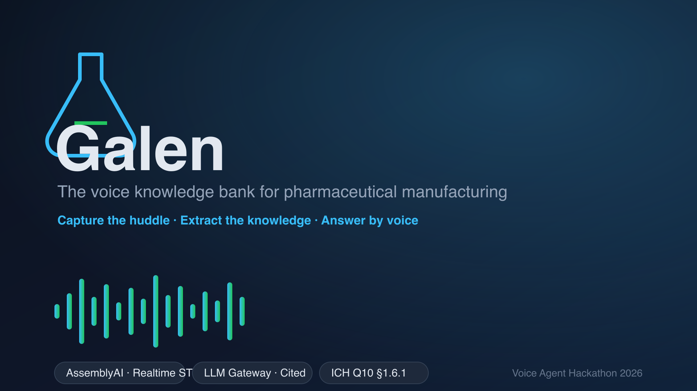

# ⚗️ Galen



**A voice-native knowledge management system for pharmaceutical manufacturing.**

Shift handovers, standing huddles, and troubleshooting stories carry the most
valuable operational knowledge on a GMP plant floor — and almost none of it is
written down. *Galen* listens to those conversations, extracts
structured knowledge, anchors it to live equipment state, and answers questions
back — with citations — so that know-how survives shift changes, retirements,
and audits.

Built for the **AssemblyAI Voice Agent Hackathon** (lablab.ai).

---

## The problem

Under ICH Q10 §1.6.1, manufacturers are required to *acquire, analyse, store
and disseminate* product and process knowledge. In practice:

- Knowledge lives in people's heads and in 6am shift handovers.
- Deviations and near-misses are re-discovered because nobody wrote them down.
- New operators repeat mistakes the night shift already solved.
- QA spends hours reconstructing "what happened" after the fact.

## What it does

```
   🎙 speak                🧠 structure                 🔎 ask
┌──────────────┐      ┌────────────────────┐      ┌──────────────────┐
│ Shift huddle │ ───▶ │ Knowledge entries  │ ───▶ │ Grounded answers │
│ (multi-party,│      │ watch_out          │      │ + citations      │
│  code-switch)│      │ tip                │      │ + spoken reply   │
│              │      │ deviation_obs      │      │                  │
│              │      │ capa_candidate     │      │                  │
└──────┬───────┘      └─────────┬──────────┘      └──────────────────┘
       │                        │
       ▼                        ▼
  Realtime STT            Twin-lite state
  (speaker diarization)   (R2 temp, Line 4 OEE)
```

1. **Capture** — a shift huddle is transcribed live with speaker diarization and
   pharma keyterms, handling English / Luganda / Swahili code-switching.
2. **Extract** — the AssemblyAI LLM Gateway turns the transcript into typed
   `KnowledgeEntry` objects, each with the transcript turns it came from. A
   deterministic regex/rule layer runs alongside so a known phrase is *never*
   missed if the model is unavailable.
3. **Anchor** — entries are tied to equipment, product, batch, and a lightweight
   live "twin" (reactor temperature, line OEE) so a warning knows *when* it
   applies. "Quiet when fine": the system only escalates what needs attention.
4. **Ask** — operators ask a question by text or voice and get an answer grounded
   in the stored entries, with citations and a spoken reply.

## Tech stack

| Layer | Technology |
| --- | --- |
| Realtime speech-to-text | AssemblyAI Streaming v3 (`universal-3-5-pro`), speaker diarization, language detection, keyterms |
| Batch speech-to-text | AssemblyAI pre-recorded transcription (speaker labels) |
| Knowledge extraction | AssemblyAI LLM Gateway (chat completions + JSON repair) |
| Grounded Q&A | AssemblyAI LLM Gateway + deterministic retrieval fallback |
| Graceful degradation | Rule-based extractor & retriever (works with no network) |
| Storage | SQLite (dev) · DynamoDB (prod, via `STORAGE_BACKEND`) |
| Voice output | Browser Web Speech API (server-side TTS pluggable) |
| Backend | FastAPI + Uvicorn |
| Frontend | Vanilla JS + Jinja2, Web Audio API / AudioWorklet for PCM capture |

## Quick start

```bash
git clone https://github.com/<you>/galen
cd galen
python -m venv .venv && source .venv/bin/activate
pip install -r requirements.txt

cp .env.example .env        # then add your AssemblyAI API key
python -m scripts.seed_demo # optional: load a realistic demo dataset
uvicorn app.main:app --reload
```

Open <http://localhost:8000>.

> **No microphone?** Use **Replay demo huddle** on the *Capture* page — it runs
> the full extract → alert → entry pipeline on a scripted shift handover.

### Environment

See [`.env.example`](.env.example). The only required key is
`ASSEMBLYAI_API_KEY`.

## Project layout

```
app/            FastAPI application and routes
agent/
  config.py     environment loading
  storage.py    SQLite schema + connection (DynamoDB swap point)
  twin.py       twin-lite equipment state and thresholds
  rules.py      deterministic phrase/pattern analysis
  extract.py    LLM Gateway extraction + rule merge + fallbacks
  query.py      grounded retrieval and answer generation
ui/             Jinja2 templates and static JS/CSS
scripts/        demo seeding
tests/          offline end-to-end tests
docs/           architecture and submission notes
```

## Design principles

- **Never lose knowledge to a failed model call.** Every LLM step has a
  deterministic fallback and every failure is surfaced, not hidden.
- **Human gate for consequential items.** High-severity deviations and CAPA
  candidates require explicit *Approve* / *Dismiss* review.
- **Quiet when fine.** The system stays silent unless something needs a human.
- **Citations or it didn't happen.** Answers reference the exact transcript turns
  and speakers behind them.

## Tests

```bash
pytest -q
```

Tests run fully offline: the LLM and network layers fall back to the
deterministic path, so the suite is fast and deterministic.

## License

MIT — see [LICENSE](LICENSE).

---

Deeper docs: [architecture](docs/ARCHITECTURE.md) ·
[deployment](docs/DEPLOYMENT.md) ·
[submission copy](docs/SUBMISSION.md).
